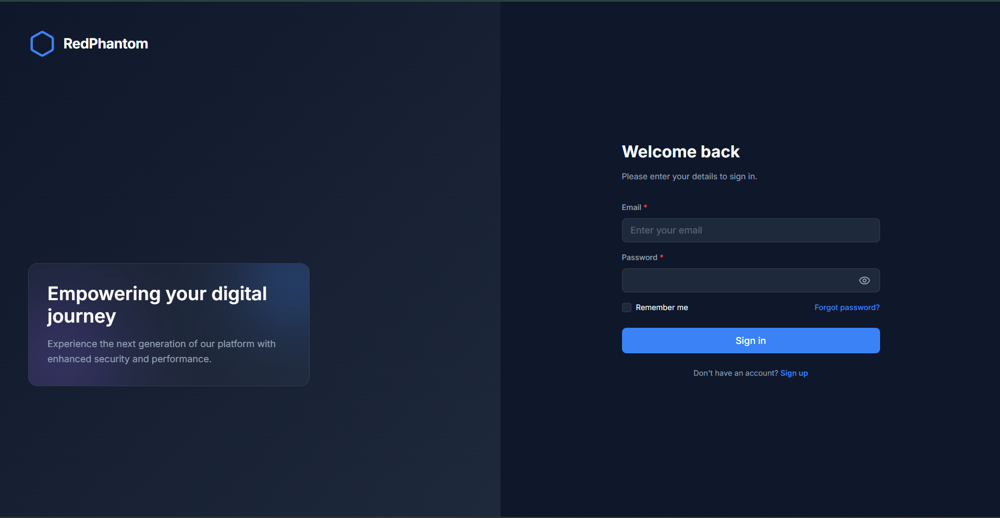
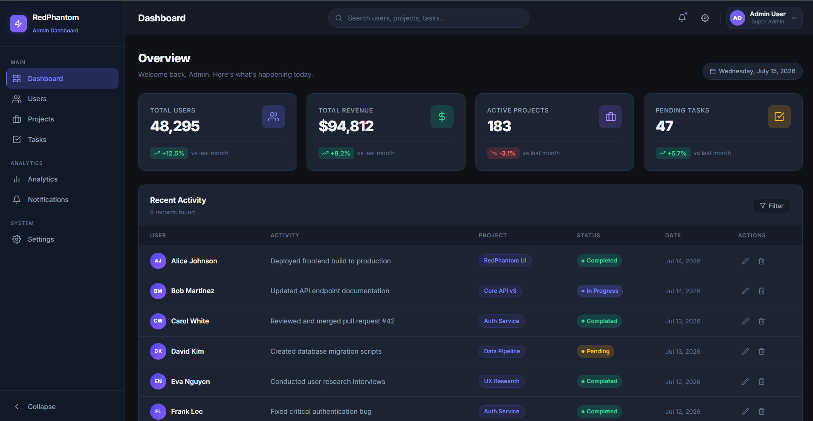

# RedPhantom Admin Dashboard

A modern, responsive, and fully-featured React Admin Dashboard merged with a sleek authentication flow. This project is built using React, Vite, React Router, and CSS Modules, featuring a dark-mode-first premium aesthetic with glassmorphism elements and smooth animations.

## 📸 Screenshots

| Login Page | Admin Dashboard |
|:---:|:---:|
|  |  |

---

## 🌟 Key Features

### 🔐 Authentication Flow
- **Protected Routes:** All dashboard pages are guarded by an authentication context (`AuthProvider`). Unauthenticated users are redirected to the `/login` page.
- **Login Page:** Features a responsive, modern split-screen design. Includes an interactive form with email/password validation, a password visibility toggle, and a "Remember me" checkbox.
- **Public Routes:** Logged-in users are automatically redirected away from the login page to the main dashboard.
- **Mock Auth Service:** Simulates network latency (1.2s delay) and returns a mock JWT token upon successful login.

### 📊 Dashboard & Layout
- **Sidebar Navigation:** Collapsible sidebar (from 260px to 72px) to maximize screen space. Features active link highlighting, section labels, hover tooltips for collapsed states, and a mobile off-canvas drawer.
- **Top Navbar:** Sticky navigation with a glassmorphism effect. Includes a search bar, notification/settings icons, and a user profile section.
- **Profile Dropdown:** Clicking the user profile opens a dropdown menu containing links to "My Profile", "Settings", and a **Logout** button.
- **Dashboard Overview:**
  - **Stat Cards:** 4 metric cards (Users, Revenue, Projects, Tasks) with animated hover states, dynamic icons, and growth trend indicators.
  - **Activity Table:** A responsive data table displaying recent activities with dynamic status badges (Completed, In Progress, Pending).
- **Placeholder Pages:** Lazy-loaded stub pages for all sidebar routes (Users, Projects, Tasks, Analytics, Notifications, Settings).

### 🎨 UI/UX & Architecture
- **Premium Dark Theme:** Built with a curated color palette (Deep slate backgrounds, Indigo/Violet accents).
- **Loading States:** Implements skeleton loaders with a shimmer effect during the simulated 900ms data fetch.
- **Responsive Design:** 
  - Mobile (1-column grid, hidden sidebar, off-canvas menu toggle).
  - Tablet (2-column grid, auto-collapsed sidebar).
  - Desktop (4-column grid, fully expanded layout).
- **Code Splitting:** Uses React Router's `lazy` and `Suspense` for performance optimization.

---

## 🛠 Technology Stack

- **Framework:** [React 19](https://react.dev/) + [Vite](https://vitejs.dev/)
- **Routing:** [React Router v7](https://reactrouter.com/)
- **Styling:** CSS Modules + Vanilla CSS (Variables, Flexbox, CSS Grid)
- **Icons:** [react-icons](https://react-icons.github.io/react-icons/) (Feather icons) & [lucide-react](https://lucide.dev/)
- **State Management:** React Context API (`AuthContext`) and native hooks (`useState`, `useEffect`).

---

## ⚙️ Installation & Setup

Follow these steps to run the application locally:

### 1. Prerequisites
Ensure you have [Node.js](https://nodejs.org/) (v18 or higher) installed on your machine.

### 2. Clone/Navigate to the Directory
If you haven't already, navigate to the project directory:
```bash
cd d:/redphantom_task1/Admin_Dashboard
```

### 3. Install Dependencies
Install all the required NPM packages:
```bash
npm install
```

### 4. Run the Development Server
Start the Vite development server:
```bash
npm run dev
```

### 5. View the Application
Open your browser and navigate to:
```
http://localhost:5173
```

---

## 🚀 Usage Guide

1. **Login:** When you first load the app, you will be on the `/login` page. Enter any email and password (the mock service accepts any input) and click "Sign in".
2. **Dashboard:** You will be redirected to the main dashboard. Notice the skeleton loaders before the mock data populates.
3. **Sidebar Interaction:** Click the collapse button at the bottom of the sidebar to toggle between expanded and compact views. Resize your browser window to see the responsive breakpoints.
4. **Logout:** Click your user profile in the top right corner of the Navbar to open the dropdown menu, then click **Logout** to clear your session and return to the login screen.

---

## 📂 Folder Structure Overview

```text
src/
├── components/          # Reusable UI components
│   ├── ActivityTable/   # Dashboard recent activity table
│   ├── DashboardCard/   # Reusable metric cards
│   ├── Login/           # Login form components (Button, Input, Checkbox)
│   ├── Navbar/          # Top navigation and profile dropdown
│   └── Sidebar/         # Collapsible side navigation
├── context/             # Global state (AuthContext.jsx)
├── data/                # Mock JSON data for the dashboard
├── hooks/               # Custom hooks (useForm.js, useLogin.js)
├── layouts/             # MainLayout wrapper for authenticated routes
├── pages/               # Route pages (Dashboard, LoginPage, PlaceholderPages)
├── services/            # Simulated API services (api.js, authService.js)
├── styles/              # Global CSS, variables, and login-specific styles
├── utils/               # Helper functions (validators.js)
├── App.jsx              # Main router and route protection logic
└── main.jsx             # React application entry point
```
